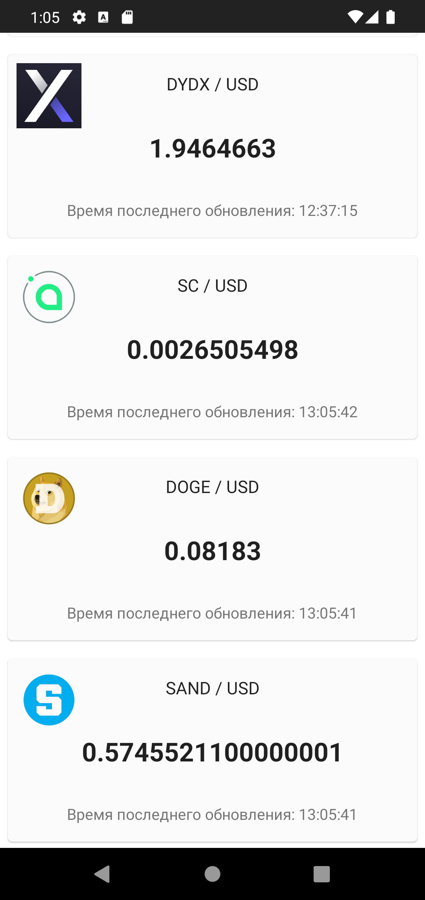
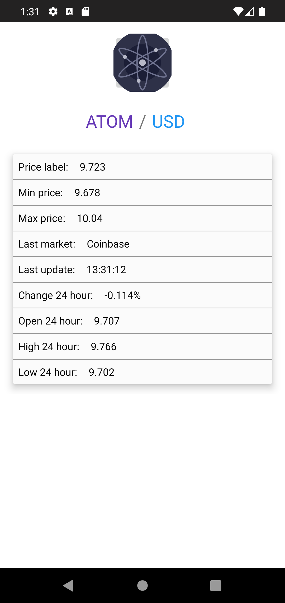

# Coin IData
 Coin IData demonstrates information about crypto currencies using online updating 
 | Main Screen | Detail Info Screen |
| ------------- | ------------- |
|  | 
 
## Tech stack & Open-source libraries
* Minimum SDK level 23
#### 1. Architecture
* Clean Code
* MVVM Architecture
#### 2. Data
* Room
* Retrofit
* Work Manager
#### 3. Base Structure
* Single Activity
* Fragments
* UseCases
* Coroutines
#### 4. UI
* Picasso
#### 5. DI
* Dagger

________

### Open API
Coin IData using the open source api [Crypto Compare](https://www.cryptocompare.com/)
